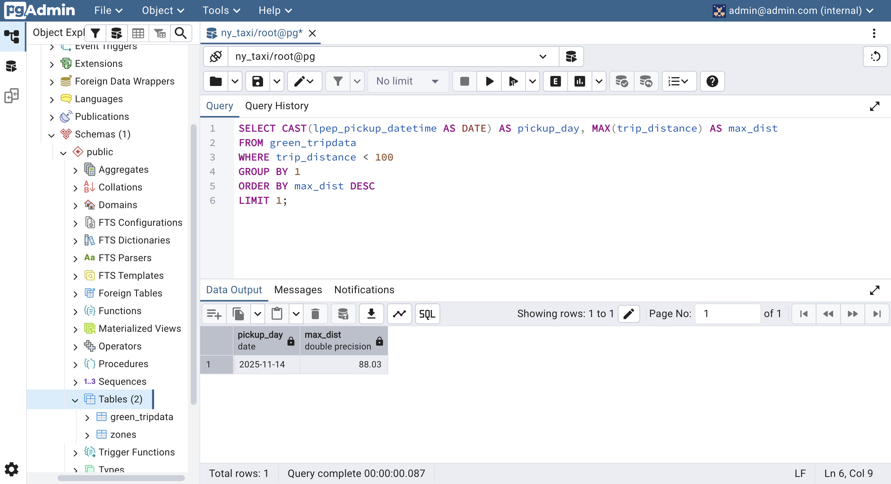
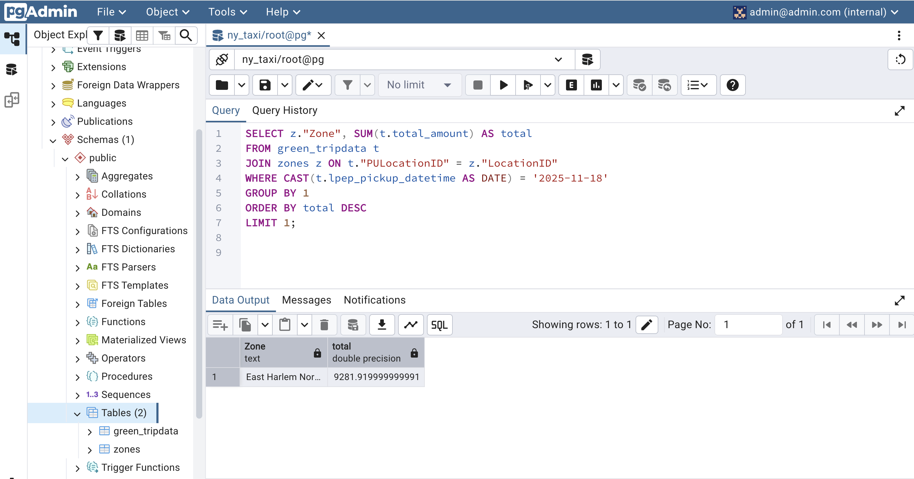
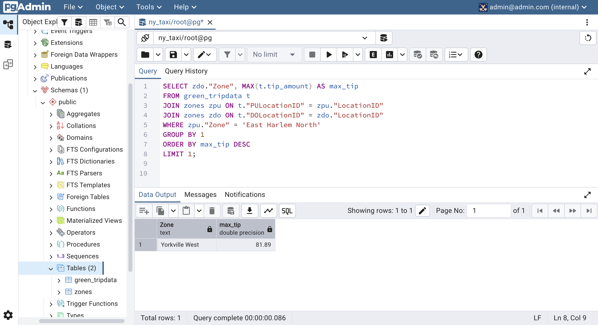

# Module 1 Homework: Docker & SQL

In this homework we'll prepare the environment and practice
Docker and SQL

When submitting your homework, you will also need to include
a link to your GitHub repository or other public code-hosting
site.

This repository should contain the code for solving the homework.

When your solution has SQL or shell commands and not code
(e.g. python files) file format, include them directly in
the README file of your repository.

## Question 1. Understanding Docker images
Run docker with the `python:3.13` image. Use an entrypoint `bash` to interact with the container.

What's the version of `pip` in the image?

- 25.3
- 24.3.1
- 24.2.1
- 23.3.1

**MY ANSWER:**
```bash
@red-moonx ➜ /workspaces/data-engineering-zoomcamp/01_docker-and-terraform/homework (main) $ docker run -it --rm --entrypoint=bash python:3.13
Unable to find image 'python:3.13' locally
3.13: Pulling from library/python
2ca1bfae7ba8: Pull complete 
82e18c5e1c15: Pull complete 
be442a7e0d6f: Pull complete 
26d823e3848f: Pull complete 
ca4b54413202: Pull complete 
b6513238a015: Pull complete 
9b57076d00d4: Pull complete 
Digest: sha256:c8b03b4e98b39cfb180a5ea13ae5ee39039a8f75ccf52fe6d5c216eed6e1be1d
Status: Downloaded newer image for python:3.13
root@9d8591301c58:/# pip --version
pip 25.3 from /usr/local/lib/python3.13/site-packages/pip (python 3.13)
root@9d8591301c58:/# 
```
The version of `pip` is **25.3**.

## Question 2. Understanding Docker networking and docker-compose
Given the following `docker-compose.yaml`, what is the `hostname` and `port` that pgadmin should use to connect to the postgres database?

```yaml
services:
  db:
    container_name: postgres
    image: postgres:17-alpine
    environment:
      POSTGRES_USER: 'postgres'
      POSTGRES_PASSWORD: 'postgres'
      POSTGRES_DB: 'ny_taxi'
    ports:
      - '5433:5432'
    volumes:
      - vol-pgdata:/var/lib/postgresql/data

  pgadmin:
    container_name: pgadmin
    image: dpage/pgadmin4:latest
    environment:
      PGADMIN_DEFAULT_EMAIL: "pgadmin@pgadmin.com"
      PGADMIN_DEFAULT_PASSWORD: "pgadmin"
    ports:
      - "8080:80"
    volumes:
      - vol-pgadmin_data:/var/lib/pgadmin

volumes:
  vol-pgdata:
    name: vol-pgdata
  vol-pgadmin_data:
    name: vol-pgadmin_data
```

- postgres:5433
- localhost:5432
- db:5433
- postgres:5432
- db:5432

If multiple answers are correct, select any

**MY ANSWER:**
The hostname and port are **db:5432** (or `postgres:5432`). Inside the Docker Compose network, services communicate using the service/container name and the internal port (5432), rather than the host-mapped port (5433). I believe it is more correct to use the service name instead of the container name (although both are valid), therefore if having to choose one, I would select **db:5432** 

## Prepare the Data
Download the green taxi trips data for November 2025:

```bash
wget https://d37ci6vzurychx.cloudfront.net/trip-data/green_tripdata_2025-11.parquet
```

You will also need the dataset with zones:

```bash
wget https://github.com/DataTalksClub/nyc-tlc-data/releases/download/misc/taxi_zone_lookup.csv
```


## Steps taken to load the data into Postgres
To load the data into Postgres, I've implemented the following changes to the workshop's `ingest_data.py` and environment:
1. Added support for both CSV and Parquet files, replaced hardcoded URLs with a flexible `--file-path` parameter, and added automatic datetime detection for Green taxi columns.
2. Added `click`, `sqlalchemy`, `psycopg2-binary`, and `tqdm` to `pyproject.toml` (did not run them during the lectures).
3. Generated `docker-compose.yaml` to orchestrate `pgdatabase` (Postgres 18) and `pgadmin` (the most "advanced" choice from the ones explained in the course).
4. Implemented a Dockerfile.
5. I used Antigravity for help implementing the steps above and draft the SQL queries for following questions

## Question 3. Counting short trips
For the trips in November 2025 (lpep_pickup_datetime between '2025-11-01' and '2025-12-01', exclusive of the upper bound), how many trips had a `trip_distance` of less than or equal to 1 mile?

- 7,853
- 8,007
- 8,254
- 8,421

**MY ANSWER:**
Because my knowledge of SQL is very basic, I utilized AI tools to assist drafting these queries, which I later verified.

```sql
SELECT count(*) 
FROM green_tripdata 
WHERE lpep_pickup_datetime >= '2025-11-01' AND lpep_pickup_datetime < '2025-12-01' 
  AND trip_distance <= 1;
```
The answer is **8,007**.


## Question 4. Longest trip for each day
Which was the pick up day with the longest trip distance? Only consider trips with `trip_distance` less than 100 miles (to exclude data errors).

Use the pick up time for your calculations.

- 2025-11-14
- 2025-11-20
- 2025-11-23
- 2025-11-25

**MY ANSWER:**
```sql
SELECT CAST(lpep_pickup_datetime AS DATE) AS pickup_day, MAX(trip_distance) AS max_dist
FROM green_tripdata
WHERE trip_distance < 100
GROUP BY 1
ORDER BY max_dist DESC
LIMIT 1;
```
The day with the longest trip is **2025-11-14**.


## Question 5. Biggest pickup zone
Which was the pickup zone with the largest `total_amount` (sum of all trips) on November 18th, 2025?

- East Harlem North
- East Harlem South
- Morningside Heights
- Forest Hills

**MY ANSWER:**
```sql
SELECT z."Zone", SUM(t.total_amount) AS total
FROM green_tripdata t
JOIN zones z ON t."PULocationID" = z."LocationID"
WHERE CAST(t.lpep_pickup_datetime AS DATE) = '2025-11-18'
GROUP BY 1
ORDER BY total DESC
LIMIT 1;
```
The pickup zone with the largest total amount is **East Harlem North**.


## Question 6. Largest tip
For the passengers picked up in the zone named "East Harlem North" in November 2025, which was the drop off zone that had the largest tip?

Note: it's `tip` , not `trip`. We need the name of the zone, not the ID.

- JFK Airport
- Yorkville West
- East Harlem North
- LaGuardia Airport

**MY ANSWER:**
```sql
SELECT zdo."Zone", MAX(t.tip_amount) AS max_tip
FROM green_tripdata t
JOIN zones zpu ON t."PULocationID" = zpu."LocationID"
JOIN zones zdo ON t."DOLocationID" = zdo."LocationID"
WHERE zpu."Zone" = 'East Harlem North'
GROUP BY 1
ORDER BY max_tip DESC
LIMIT 1;
```
The drop-off zone with the largest tip is **Yorkville West**.
 

## Terraform
In this section homework we'll prepare the environment by creating resources in GCP with Terraform.

In your VM on GCP/Laptop/GitHub Codespace install Terraform.
Copy the files from the course repo
[here](../../../01-docker-terraform/terraform/terraform) to your VM/Laptop/GitHub Codespace.

Modify the files as necessary to create a GCP Bucket and Big Query Dataset.

## Question 7. Terraform Workflow
Which of the following sequences, respectively, describes the workflow for:
1. Downloading the provider plugins and setting up backend,
2. Generating proposed changes and auto-executing the plan
3. Remove all resources managed by terraform`

Answers:
- terraform import, terraform apply -y, terraform destroy
- teraform init, terraform plan -auto-apply, terraform rm
- terraform init, terraform run -auto-approve, terraform destroy
- terraform init, terraform apply -auto-approve, terraform destroy
- terraform import, terraform apply -y, terraform rm

**MY ANSWER:**
The workflow is **terraform init, terraform apply -auto-approve, terraform destroy**. 
- `init`: Prepares the environment and downloads providers. 
- `apply -auto-approve`: Both creates/updates resources and bypasses the confirmation prompt. 
- `destroy`: Correctly removes all managed infrastructure.

## Learning in Public
This first module has been an intensive learning curve. While I began with only a conceptual understanding of containerization and no prior experience ofTerraform, I have somehow managed to deploy multi-container architectures.

Throughout this module, I used AI tools to bridge gaps in complex architectural concepts, which I tried to document in the notes I have added to this repository.

Finally, I utilized Antigravity to streamline the heavy lifting of authoring the Dockerfile and docker-compose.yaml files. Because of my basic knowledge of SQL I also used it to draft the SQL queries, which I then manually verified.

While in principle it is more advanced for my level, I am very happy with the progress I have made in this module.