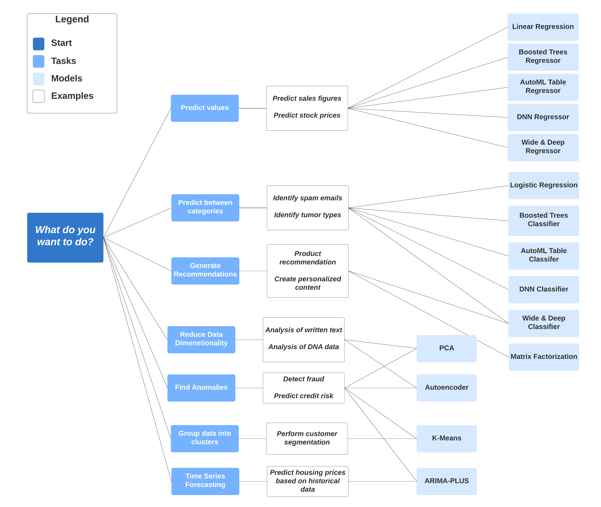

# Module 3: Data Warehouse

Here are my notes for Module 3 of the Data Engineering Zoomcamp course.

## 1. Introduction to Data Warehouse and Bigquery

In this module, we explore the concepts of Data Warehousing and learn how to use Google BigQuery for efficient data storage and analysis.

### OLAP vs OLTP

OLAP and OLTP are two primary data processing systems, but they serve different purposes:

| Feature | OLTP (Online Transaction Processing) | OLAP (Online Analytical Processing) |
| :--- | :--- | :--- |
| **Focus** | Day-to-day operations | Data analysis and decision making |
| **Operations** | Short, fast updates | Long-running, complex read queries |
| **Data Volume** | Small transactions (GBs) | Massive datasets (TBs/PBs) |
| **Data Structure** | Highly Normalized (3NF) | Denormalized (Star/Snowflake Schema) |
| **Access Pattern** | Row-oriented | Column-oriented |
| **Latency** | Low latency (millis) | Higher latency (seconds/minutes) |

### Data Warehouse

A data warehouse is a database that stores data for analysis and decision-making. It is a central repository containing different sort of data, tipically raw data, metadata and summary data. It is fed by different data sources that first report to a staging area which is then written to a data warehouse. The data warehouse can be transformed to Data Marts (smaller subsets of the data warehouse, for example: purchasing, sales, inventory...) for easier analysis. A data warehouse provides all these possibilities of accessing raw data, summary data or data marts. 

### Bigquery

BigQuery is a serverless, highly scalable, and cost-effective cloud data warehouse. It allows you to analyze large datasets using SQL queries, and it integrates with other Google Cloud services. BigQuery is a columnar database, which means that it stores data in columns rather than rows. This makes it very efficient for analytical queries, as it only needs to read the columns that are needed for the query. It has built-in functions such as machine learning (via de SQL interface), geospatial analysis or business intelligence. It maximizes flexibility by separating the compute engine (data analysis) from the storage engine. It also huge library of public datasets

BigQuery pricing modes are on-demand (pay per TB of data processed) or flat rate (pay for a fixed number of slots/compute capacity). Flat rate only makes sense when processing way above 200 terabytes of data. 

#### Other GCP components related to BigQuery

- **External Table**: A table definition that points to data stored outside of BigQuery (e.g., in GCS), allowing you to query it without loading the data.
- **Project**: The logical organizer and billing unit for all your resources (BigQuery datasets, Storage buckets, compute instances).
- **Bucket**: A container in Google Cloud Storage (GCS) where you store files (objects).
- **Service Account**: A special account for non-human users (like your Kestra workflow) with specific permissions to act on resources.
- **Cloud Storage URI (`gs://`)**: A path pointing to a file or folder in a GCS bucket (e.g., `gs://bucket/file.csv`).

## 2. BigQuery fundamentals

### 2.1 Partitioning and Clustering

- **Partitioning**: Splits a table into smaller segments based on a specific column (usually date or time), saving space and costs, and speeding up queries. 
- **Clustering**: Reorders data within those partitions based on other columns (like `tag` or `customer_id`), keeping related data close together for faster retrieval. 

Important considerations:
- When using time for partinioting the default is daily, but it can be modified to hourly, monthly, yearly, etc. (with a limit of partitions being 4,000). Clustering is not limited in the number of columns (up to 4).
- It is not recommended to partition and clustering a table < 1 Gb size, it doesn't improve performance but maintaining it will increase costs.
- When to use partioning, when clustering, and when both? For that we need to look at their properties:

**Partitioning**
- **Definition**: Splits your table into "segments" based on a single column (usually a Date or an Integer).
- **Cost known upfront**: Because the data is separated into physical "buckets", BigQuery knows exactly how much data to scan.
- **Partition-level management**: Easily delete or replace specific partitions (e.g., a single day) without touching the rest.
- **Filter on a single column**: Ideal when you frequently filter by that specific column.

**Clustering**
- **Definition**: Sorts data within partitions based on one or more columns (up to 4).
- **Cost benefit unknown**: You'll save money, but exact estimates aren't available before execution.
- **High Cardinality & Granularity**: Perfect for columns with many unique values (like `email`) or finding specific data within a partition (e.g., "Users in Berlin" inside "January").
- **Multiple columns**: Great if you often filter by different combinations (e.g., `country` AND `category`).
- **Automatic Reclustering**: BigQuery automatically maintains the sort property for clustered tables in the background as new data arrives. However, for existing tables where clustering is subsequently added, BigQuery does not retroactively cluster pre-existing data—only new data is clustered. To fix this: You would need to overwrite the table (e.g., run a `SELECT *` and replace the table) to force BigQuery to rewrite and sort the old data.

**When to choose Clustering over Partitioning**
- **Small partitions**: When partitioning would result in small amounts of data per partition (< 1 GB).
- **High cardinality**: When you would exceed the limit of partitions (max 4,000) or have too many unique values.
- **Frequent updates**: When your pipeline modifies the majority of partitions frequently (e.g., every few minutes).

### 2.2 Best practices

- **Cost Reduction**:
    - **Avoid `SELECT *`**: BigQuery is a columnar store, so we are charged for every column we select. It is best to query only the specific columns we need. Selecting fewer columns significantly lowers the amount of data processed.
    - **Price our queries**: Use the UI or API (dry run) to see the estimated bytes processed *before* we run the query. This helps us estimate costs and avoid expensive surprises before execution.
    - **Use clustered or partitioned tables**: Reading only the necessary partitions/clusters drastically reduces the data scanned and the cost. 
    - **Use streaming inserts with caution**: Streaming data (`insertAll`) refers to sending data as it happens (row by row). It incurs extra costs. If possible, load data in bulk (Load Jobs) which is free. Batch loading is preferred for large periodic updates to keep costs down.
    - **Materialize query results**: If we run a complex query often, it is better to save the result to a table (materialization; in BigQuery's own native storage) to avoid recomputing it every time. 

- **Query Performance**:
    - **Filter on partitioned columns**: Always use the partition column in our `WHERE` clause. Scanning partitions irrelevant to our query wastes processing power. It ensures the query engine targets only the relevant data slices.
    - **Denormalizing data**: BigQuery performs better with flat or nested data structures (like JSON) rather than many relational tables. Use nested/repeated fields to keep related data together and minimize expensive JOINs. This takes advantage of BigQuery's columnar nature and avoids the overhead of shuffling data for joins.
    - **Use external data sources appropriately**: External tables (reading from GCS) are slower than reading native BigQuery tables. For heavy workloads, load the data into BigQuery storage first. Native tables are optimized for query performance, whereas external tables depend on the underlying storage speed.
    - **Reduce data before using a JOIN**: JOIN operations are resource-intensive. Apply filters and aggregations to reduce table size *before* the JOIN to lower the computational cost. Processing smaller datasets in the join stage is much faster and consumes less memory.
    - **Do not treat WITH clauses as prepared statements**: A `WITH` clause (CTE) is helpful for readability, but BigQuery may re-evaluate the query inside it multiple times if referenced multiple times. It does not cache the result like a variable. If a CTE is costly and used twice, it's better to materialize it into a temporary table first.
    - **Avoid oversharding tables**: Creating thousands of separate tables (e.g., one per day) degrades metadata performance. Use a single Partitioned Table instead. Partitioning single tables is more efficient for the query engine than managing metadata for many small tables.
    - **Avoid JavaScript user-defined functions**: JavaScript UDFs are slower and consume more resources than native SQL functions. Whenever possible, rewrite logic using native SQL expressions to improve performance.
    - **Use approximate aggregation functions**: for count distinct, use `HyperLogLog++` functions (like `APPROX_COUNT_DISTINCT`). These estimation functions are significantly faster and cheaper than exact counts for massive datasets, with negligible error rates. The HyperLogLog++ algorithm estimates the number of unique items in a massive dataset by hashing data into binary and tracking the longest sequence of leading zeros observed.
    - **Order Last**: perform sorting operations (`ORDER BY`) only at the very end of your query. Sorting is computationally expensive, so it should be applied only to the final, aggregated result set rather than intermediate steps.
    - **Optimize your join patterns**: BigQuery performs best when the largest table is placed on the left side of the `JOIN`. As a best practice, place the table with the largest number of rows first, followed by the table with the fewest rows, and then place the remaining tables by decreasing size.

### 2.3 Internals
BigQuery stores data in a columnar format (columnar-oriented) instead of record (row-oriented).

BigQuery separates storage from compute. If the data size increases, we only need to pay for the storage in Colossus (very cheap). If we need more compute power, we can rent more slots. Computing (reading data, running queries) is the most expensive. This takes place in Dremel (query execution engine). Dremel works by making a tree structure and running a subset of the query in a different node. 

How do the communication between storage and computing work? This process is optimized through jupyter networks in BQ's data centers.

## 3. Machine Learning with BigQuery

The main advantage of BigQuery ML is that we can train and deploy machine learning models directly in BigQuery using SQL queries, without needing to export data to other tools. The con is the price (generally it will be cheaper to keep BigQuery as our warehouse and build and train models somewhere else).

### Pricing

**Free Tier limits:**
- **Data storage**: 10 GB per month
- **Queries processed**: 1 TB per month
- **ML Create model step**: First 10 GB per month is free

### Steps
BigQuery ML supports all key machine learning steps, including automatic feature engineering, splitting data for training and evaluation, supporting various algorithms (see supported algorithms below), hyperparameter tuning, validation, and model deployment (e.g., using a Docker image).

### Supported Algorithms
Different algortums are supported depending on the type of problem. For example, for predicting stock prices, we can use linear regression, boosted trees, DNN regression, etc. 

For example, for the NY taxi dataset, if we want to predict the tip amount, we have first to select the columns of the dataset that may have an influence (passenger count, trip distance, fare amount...). 

Some of these columns will require automatic or manual feature engineering (preprocessing).

