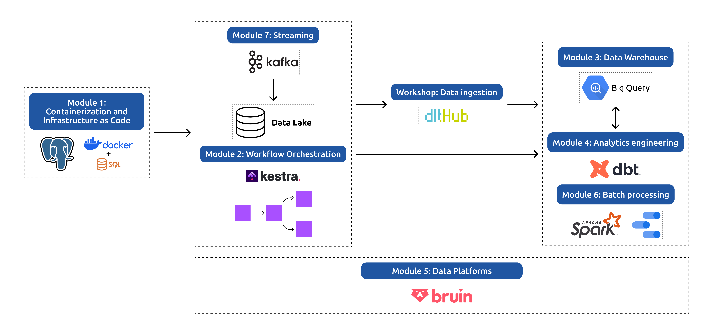

# Data Engineering Zoomcamp

This repository contains my work for the [Data Engineering Zoomcamp](https://github.com/DataTalksClub/data-engineering-zoomcamp) by [DataTalksClub](https://datatalks.club/), which I'm taking as part of the 2026 Cohort (5th Edition).

---

## 📚 Course Curriculum

The course is composed of the following modules:

### 🛠️ Module 1: Containerization and Infrastructure as Code
- Introduction to GCP
- Docker and Docker Compose
- Running PostgreSQL with Docker
- Infrastructure setup with Terraform
- Homework

### 🔄 Module 2: Workflow Orchestration
- Data Lakes and Workflow Orchestration
- Workflow Orchestration with Kestra
- Homework

### 🧪 Workshop 1: Data Ingestion
- API reading and pipeline scalability
- Data normalization and incremental loading
- Homework

### 🏛️ Module 3: Data Warehousing
- Introduction to BigQuery
- Partitioning, clustering, and best practices
- Machine Learning in BigQuery

### 📊 Module 4: Analytics Engineering
- Analytics Engineering and Data Modeling
- dbt (data build tool) with DuckDB & BigQuery
- Testing, documentation, and deployment

### 🗄️ Module 5: Data Platforms
- Building end-to-end data pipelines with Bruin
- Data ingestion, transformation, and quality
- Deployment to cloud (BigQuery)

### 🚀 Module 6: Batch Processing
- Introduction to Apache Spark
- DataFrames and SQL
- Internals of GroupBy and Joins

### 📡 Module 7: Streaming
- Introduction to Kafka
- Kafka Streams and KSQL
- Schema management with Avro

### 🎓 Final Project
- Apply all concepts learned in a real-world scenario
- Peer review and feedback process

